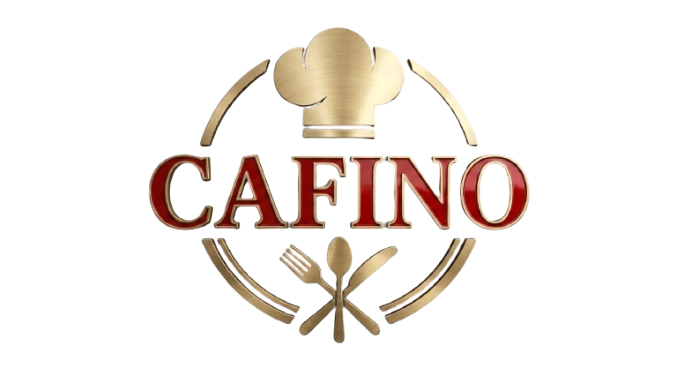

<div align="center">



# ☕ Cafino Cafe Jaffna — Bill / Invoice Generator

**A modern, premium, fully client-side POS billing & e-receipt generator built with plain HTML, CSS, and JavaScript.**

No backend · No frameworks · No build step · Just open and bill.


</div>

---

## 📖 Overview

**Cafino Cafe Jaffna Bill Generator** is a lightweight, professional point-of-sale (POS) billing tool for a real cafe. A cashier picks items from a tap-to-add menu, the total is calculated automatically, and a clean **thermal e-receipt** can be printed or saved as PDF straight from the browser — all without any server, database, or internet connection.

It runs entirely in the browser and works great on **mobile phones, tablets, and desktops**.

---

## ✨ Features

- 🧾 **Professional e-receipt layout** for Cafino Cafe Jaffna with branded logo, tagline & contact details.
- 🔢 **Auto-generated bill numbers** in `CAF-YYYYMMDD-001` format (daily sequence persists via `localStorage`).
- 🕒 **Auto-filled date & time** on every new bill.
- 👤 **Customer details** — name + phone, with **Sri Lankan phone-number validation** (`0771234567`, `+94771234567`, etc.).
- 🍽️ **Tap-to-add Quick Menu** of all cafe products with **fixed, non-editable prices** (search included).
- ➕➖ **Editable quantities** per item with instant **automatic total calculation**.
- 💳 **Payment methods** — Cash, Card, Online Payment (with reference / transaction ID field).
- ✅ **Paid / Pending status** with a clear colour-coded stamp on the receipt.
- 🔒 **Auto, read-only "Amount Paid"** that mirrors the grand total (no manual editing).
- 🖨️ **One-click export** → opens the print dialog to print or **Save as PDF** a compact **80 mm thermal e-bill**.
- 👨‍🍳 **Cashier selector** (P.Manojan, Y.Vithushan, N.Vimal).
- 📱 **Fully responsive**, mobile-first UI with a premium cafe colour palette (dark brown, cream, gold, deep red).
- 🛡️ **Input validation** so empty/invalid values never break the calculations.

---

## 🗂️ Project Structure

```
cafino-app/
├── index.html              # Markup / page structure
├── style.css               # All styling + thermal print rules
├── script.js               # Billing logic + product catalogue
└── assets/
    └── cafino-logo.jpg      # Brand logo
```

> A single self-contained version (`cafino-invoice-generator.html`) is also available if you prefer everything in one file.

---

## 🚀 Getting Started

No installation, dependencies, or build tools required.

1. **Clone the repository**
   ```bash
   git clone https://github.com/<your-username>/cafino-cafe-jaffna-billing.git
   cd cafino-cafe-jaffna-billing
   ```
2. **Open it**
   - Simply double-click `index.html`, **or**
   - Serve it locally (recommended, so the logo & files load correctly):
     ```bash
     # Python 3
     python -m http.server 8000
     # then visit http://localhost:8000
     ```

> ℹ️ Because the project loads `style.css`, `script.js`, and the logo as separate files, opening it through a local server (or hosting it) ensures all assets load. The single-file version works by double-clicking directly.

---

## 🖨️ Printing / Saving as PDF

1. Add items from the **Quick Menu**.
2. Fill in customer details and choose the **payment method** and **status**.
3. Click **🧾 Export / Print E-Bill**.
4. In the print dialog, choose your thermal printer **or** select **"Save as PDF"** as the destination.

The receipt is laid out for an **80 mm thermal roll**, with all on-screen controls automatically hidden in print.

---

## 🛠️ Built With

- **HTML5** — semantic structure
- **CSS3** — custom properties, responsive grid/flex layout, print media queries
- **Vanilla JavaScript** — no libraries, no frameworks

---

## 🌐 Deployment

This is a static site — deploy it anywhere:

- **GitHub Pages** — Settings → Pages → deploy from the repo root.
- **Netlify / Vercel / Cloudflare Pages** — drag & drop the folder.

---

## 🔧 Customisation

- **Products & prices** → edit the `PRODUCTS` array in `script.js`.
- **Cashier names** → edit the `<select id="cashier">` options in `index.html`.
- **Contact details / branding** → edit the header in `index.html` and the logo in `assets/`.

---

## 📄 License

Released under the **MIT License** — free to use and modify.

---

<div align="center">

**Cafino Cafe Jaffna** · *Premium Coffee • Fresh Food • Jaffna*
📍 Jaffna, Sri Lanka · 📞 +94 76 288 2931 · ✉️ cafinocafejaffna@gmail.com

</div>
